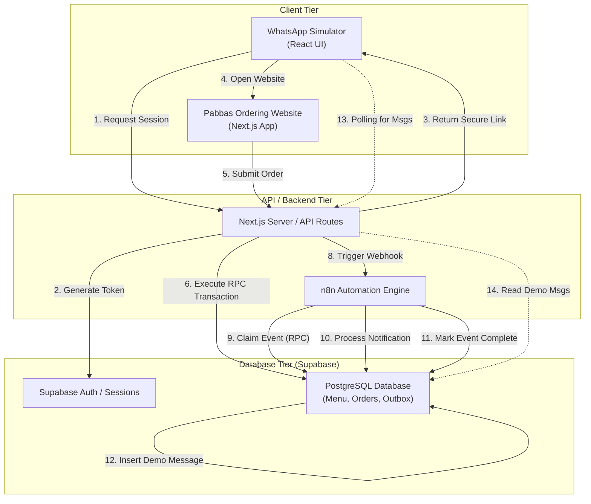
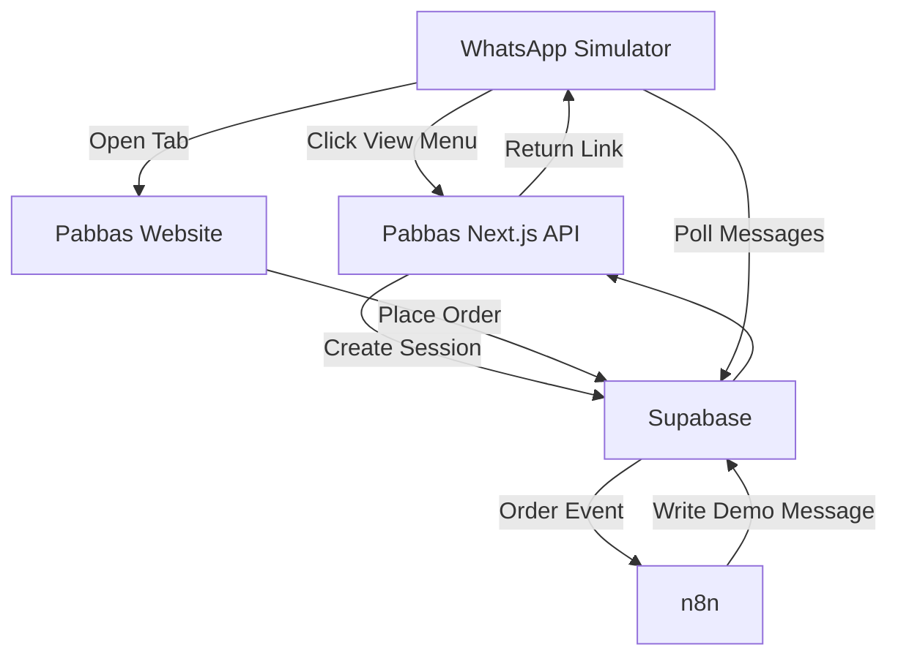
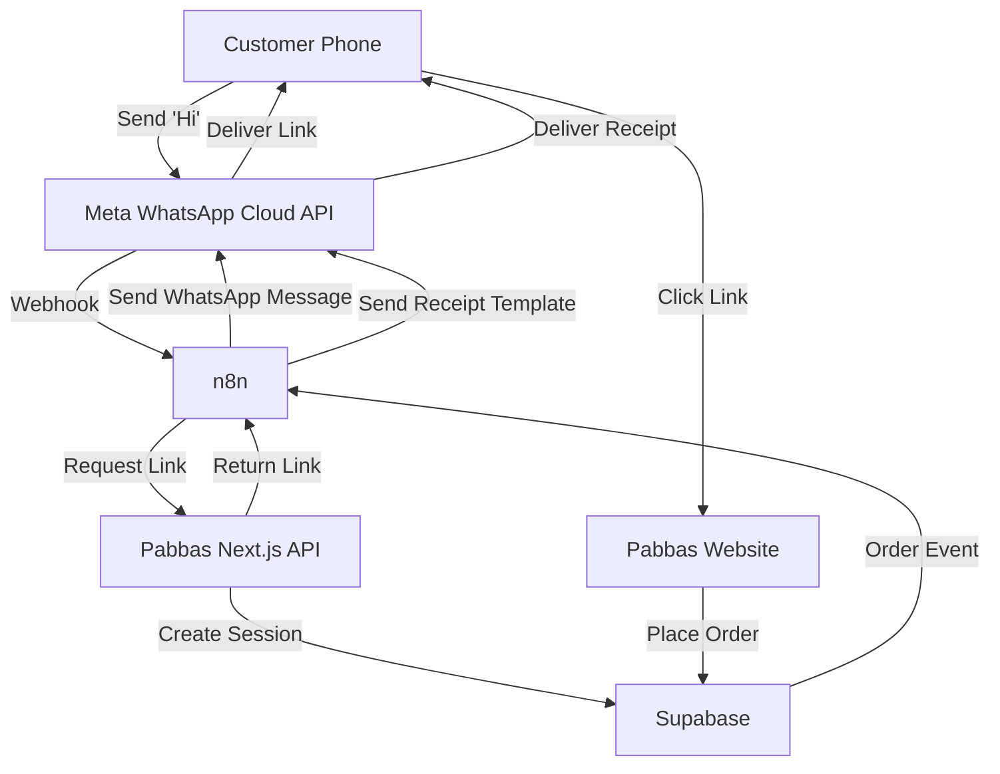
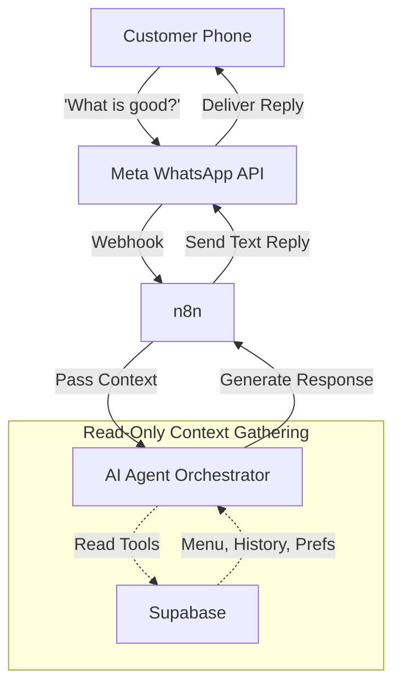

# Pabbas Complete Technical Documentation

Welcome to the **Pabbas Ordering System** comprehensive technical documentation. This documentation is the long-term technical reference and developer handover for this project.

# 1. Project Overview

## What is the Pabbas Ordering System?
The Pabbas Ordering System is a modern, mobile-first web application and backend automation system designed to facilitate delivery, takeaway, and dine-in orders for the Pabbas restaurant. 

## Business Problem
Traditional ordering systems require customers to download apps, remember passwords, or navigate clunky web forms. Pabbas wanted a frictionless system where customers can order securely through their most used app: WhatsApp.

## Technical Objective
Build a secure, scalable "WhatsApp-first" ordering architecture. Instead of building a chatbot to handle complex ordering UX (which is frustrating for users), the system bridges the gap between a chat interface and a rich web interface.

Customers start in WhatsApp, click a secure link, seamlessly browse a rich Next.js menu, place their order, and receive their receipt back in WhatsApp.

## Current Capability (STAGE A: CEO DEMO)
The current implementation successfully proves the end-to-end architecture:
- A custom **WhatsApp Simulator** acts as the frontend entry point.
- Customers click **"View Menu & Order"** and are securely routed to the Pabbas Next.js website via a one-time cryptographic token.
- The website provides a beautiful, responsive cart and checkout experience for Delivery, Takeaway, and Dine-In.
- Supabase acts as the secure, authoritative system of record (Database, RPCs, Row Level Security).
- **n8n** acts as the automation layer, securely reading new orders from a Transactional Outbox and sending a mock order confirmation back to the Simulator.

## Long-Term Production Vision
The ultimate vision is to replace the Simulator with the **Meta WhatsApp Business Cloud API**.

In the future, the system will feature:
1. **Customer Recognition:** Recognizing users by their phone number seamlessly.
2. **AI-Assisted Conversations:** Replacing static menus with an intelligent AI orchestrator capable of answering menu questions, making personalized recommendations based on order history, and handling customer support.
3. **Frictionless Ordering:** Securely handing off complex UX (like cart building and payment) to the Next.js web application, while keeping all conversational context in WhatsApp.


# 2. Project History

The Pabbas Ordering System evolved iteratively. Below is the complete history of how the current architecture was achieved.

### Stage 1: Initial Pabbas Website
The project began as a static presentation website for Pabbas, establishing the brand colors, layout, and UX standards.

### Stage 2: Next.js Implementation
The static site was migrated to **Next.js (App Router)** and **Tailwind CSS** to allow for dynamic data fetching, server components, and modern React development.

### Stage 3: Supabase Integration
**Supabase** was introduced as the backend database and authentication layer, providing PostgreSQL, Row Level Security (RLS), and serverless Edge Functions (via RPCs).

### Stage 4: WhatsApp-First Architecture Decision
A strategic decision was made to abandon traditional email/password authentication. The business objective required a frictionless flow starting from WhatsApp.

### Stage 5: Secure WhatsApp-Linked Sessions
To bridge WhatsApp and the web securely without passwords, we implemented a **One-Time Token** system. When a user clicks a link in WhatsApp, the server generates a token, which the Next.js app consumes to set an HTTP-only secure session cookie mapping to the user's Supabase UUID.

### Stage 6: Customer Profile Memory
The `app_customers` and `customer_addresses` tables were implemented so the system remembers the user across different WhatsApp sessions. The user never types their phone number; it is inherited from the secure session.

### Stage 7: Real Menu Architecture
The hardcoded menu was replaced with a dynamic, database-driven menu (`menu_categories`, `menu_items`, `menu_item_variants`). Pricing was strictly defined in `paise` (integers) to prevent floating-point errors.

### Stage 8: Cart and Checkout
A rich, client-side Cart context was built. Crucially, the frontend calculates estimates, but the **backend Supabase RPC** strictly enforces real prices and totals.

### Stage 9: Delivery / Takeaway / Dine-In
The order schema (`orders`) was expanded to support three distinct order types, capturing necessary metadata (scheduled times, tables, addresses). Address snapshots were implemented to prevent historical orders from changing if a user edits their address later.

### Stage 10: Atomic Table Reservation
Dine-in ordering required a robust concurrency model. We implemented atomic locking via Supabase RPC (`reserve_table`) to prevent double-booking of restaurant tables.

### Stage 11: Transactional Order Outbox
To ensure reliable third-party integrations (like WhatsApp notifications), we implemented the **Transactional Outbox Pattern** (`order_events` table). Orders and their corresponding events are created in a single atomic database transaction.

### Stage 12: n8n Order Event Processing
An **n8n** automation layer was introduced to process `order_events`. Using a webhook, n8n securely "claims" an event, ensuring only one worker processes an order notification at a time.

### Stage 13: WhatsApp Simulator
To demo the entire flow without a costly/complex Meta Business API approval process, a local **WhatsApp Simulator** was built (`/dev/whatsapp`). It acts as a sandbox representing the customer's phone.

### Stage 14: CEO Demo Notification Bridge
The final link was closing the loop: connecting the n8n webhook's success path back to the WhatsApp Simulator. The Simulator polls `dev_whatsapp_messages` to display the simulated confirmation message.

### Stage 15: Future Meta WhatsApp Business API (PLANNED)
The Simulator will be replaced by the real Meta Cloud API. n8n will handle inbound/outbound Meta webhooks. The core ordering system will remain 100% unchanged.

### Stage 16: Future AI Personalization (PLANNED)
An AI Orchestrator will be inserted into the n8n flow to handle unstructured customer text (e.g., "What's good today?"), using Supabase as a read-only context tool, before eventually serving the secure order link.


# 3. System Architecture

This document outlines the current state of the architecture (Stage A: CEO Demo). 

## Current Architecture Diagram



## Component Roles

### 1. Next.js (App Router)
Acts as both the frontend UI and the secure middle-tier. Contains React components for the cart/menu and secure API routes that validate requests before communicating with Supabase.

### 2. Supabase
The authoritative System of Record. 
- All pricing, inventory, and table availability logic lives here via strictly locked **RPCs (Remote Procedure Calls)**.
- Row Level Security (RLS) ensures that the Next.js frontend can only access data belonging to the authenticated session.

### 3. n8n
The asynchronous workflow orchestrator.
- Listens for new order events.
- Safely "claims" events from the database to prevent duplicate processing.
- Generates outbound notifications.

### 4. WhatsApp Simulator
A development-only tool (`/dev/whatsapp`) used to demonstrate the customer experience without requiring a live Meta developer account. It relies on a mock database table (`dev_whatsapp_messages`) to display outbox notifications.


# 4. Customer Journey & 3-Stage Long-Term Architecture

The architecture of Pabbas is designed to evolve gracefully in three distinct stages. The core business logic (Supabase + Next.js) never changes, while the interaction layer matures over time.

---

## STAGE A — CURRENT CEO DEMO
**(DEVELOPMENT / DEMO ONLY)**

In the current stage, the WhatsApp interaction is entirely simulated.



---

## STAGE B — REAL WHATSAPP BUSINESS API
**(PLANNED)**

In Stage B, the Simulator is removed entirely. The Next.js website remains identically functional. Customers interact with a real WhatsApp chat.



### What Changes:
- Simulator is deleted.
- Meta credentials are added to n8n.
- n8n receives live inbound Meta webhooks.
- n8n sends outbound messages using Meta Session/Template rules.

### What Stays Unchanged:
- Supabase RPCs, database, RLS, outbox.
- Next.js website, menu, cart, checkout.
- The fundamental concept of the "WhatsApp-linked Session".

---

## STAGE C — AI PERSONALIZED CONVERSATION
**(PLANNED)**

In Stage C, we insert an AI Orchestrator into the n8n flow. The AI acts as a conversational layer but **NEVER** acts as the system of record.



### Intended AI Capabilities:
- Natural-language conversations.
- Personalized greetings based on customer history.
- Recommending frequently ordered items.
- Understanding delivery vs dine-in intent contextually.

### IMPORTANT RULE: AI Is Not Authoritative
The AI must **NEVER** be trusted to determine final prices, order totals, menu availability, or table availability. It only guides the user. The final order placement ALWAYS routes through the secure, deterministic Next.js / Supabase architecture.


# 5. WhatsApp Simulator

The WhatsApp Simulator (`app/dev/whatsapp/page.tsx`) is a vital development tool used to demonstrate and test the "WhatsApp-first" flow without requiring a live Meta Developer account, approved phone numbers, or paid templates.

> **Note:** The simulator is strictly for local development and demo purposes. It is blocked in production.

## Why it Exists
Testing a real WhatsApp flow requires ngrok/tunnels, live webhooks, and strict adherence to Meta's 24-hour session rules. The simulator allows rapid iteration of the core Pabbas logic by mocking the interaction locally.

## How it Works

### 1. Simulated Customer Selection
The UI allows the developer to act as "Customer A" or "Customer B". These are mapped to real UUIDs in the `app_customers` table via a seed script or database state.

### 2. The "Hi" Flow
- The developer types "Hi" and taps Send.
- The UI immediately renders a mock reply from Pabbas containing a "View Menu & Order" button.
- *Note: This initial interaction is purely local React state. No API fetch is made.*

### 3. Secure Session Creation
- When the developer clicks **View Menu & Order**, the simulator makes a `POST` request to `/api/dev/whatsapp/session`.
- The API securely generates a cryptographically random token, hashes it, stores the hash in `ordering_sessions`, and returns the raw token.
- The simulator opens a new tab and navigates to the returned URL (`/auth/whatsapp?token=...`).

### 4. Mobile/LAN Support
To ensure the simulator works when a developer tests it on a mobile phone via a local network IP (`http://192.168.x.x:3000`):
- The session API returns a relative URL to prevent hardcoding `localhost`.
- The `window.open` call bypasses aggressive mobile popup blockers by opening the tab synchronously during the click event, resolving the absolute URL based on the mobile device's actual origin.
- Forms are used for inputs to guarantee reliable native mobile keyboard support.

### 5. Polling for Notifications
Once an order is placed on the website, the database creates an `order_event`. The n8n automation engine processes this event and inserts a mock text message into the `dev_whatsapp_messages` table. 

The Simulator uses a React `useEffect` to poll the `/api/dev/whatsapp/messages` endpoint every 3 seconds, looking for new messages linked to the active customer's Supabase UUID. When found, the confirmation message appears in the chat UI.


# 6. Next.js Application

The Pabbas web frontend is a modern Next.js (App Router) application. It is strictly responsible for UI rendering, secure session handling, and proxying requests to the Supabase backend. 

## Key Responsibilities

1. **Security & Session Management:** Validates cryptographic tokens, sets HTTP-only cookies, and enforces route guards.
2. **Menu Rendering:** Fetches and displays the dynamic menu from Supabase.
3. **Cart Management:** Provides client-side state for the shopping cart.
4. **Checkout & Validation:** Captures user input (addresses, scheduled times, table selections) and submits it to the backend RPCs.

## Important Files & Directories

| File / Directory | Responsibility |
|------------------|----------------|
| `app/layout.tsx` | Root layout, manages global providers (Cart, Supabase Session). |
| `app/page.tsx` | Main landing page / menu interface. |
| `app/checkout/page.tsx` | The checkout flow for Delivery, Takeaway, and Dine-In. |
| `app/auth/whatsapp/route.ts` | Consumes the one-time token, sets the session cookie, redirects user. |
| `app/api/session/me/route.ts` | Validates the current HTTP-only cookie and returns customer data. |
| `app/api/orders/route.ts` | Securely proxies checkout data to the Supabase `create_customer_order` RPC. |
| `app/dev/whatsapp/page.tsx` | Development-only WhatsApp Simulator. |
| `lib/supabase/` | Supabase client initializers (Client-side, Server-side, Admin/Service-Role). |
| `lib/session/` | Cryptographic utilities for generating and hashing tokens. |
| `components/Cart/` | React components managing the user's shopping cart and totals. |

## Server Components vs Client Components

- **Server Components (Default):** Used for initial data fetching (e.g., loading the menu). This ensures fast initial page loads and excellent SEO.
- **Client Components (`'use client'`):** Used for interactive elements like the `CartProvider`, `AddToCart` buttons, and the Simulator UI.

## Environment Variables

The Next.js app relies heavily on environment variables for security.
- `NEXT_PUBLIC_SUPABASE_URL`: Public endpoint for Supabase.
- `NEXT_PUBLIC_SUPABASE_ANON_KEY`: Public anonymous key.
- `SUPABASE_SERVICE_ROLE_KEY`: **SECRET!** Used only in protected API routes (like token generation or polling mock messages) to bypass RLS. Never exposed to the browser.


# 7. Supabase Database

Supabase is the heart of the Pabbas Ordering System. It is the authoritative system of record. It provides the PostgreSQL database, Row Level Security (RLS) policies, and Edge Functions via Remote Procedure Calls (RPCs).

## Core Tables

| Table | Purpose |
|-------|---------|
| `app_customers` | Stores customer profiles (phone number, name, preferences). |
| `ordering_sessions` | Stores hashed session tokens and tracks consumption state. |
| `customer_addresses` | Stores saved delivery addresses for customers. |
| `menu_categories` | Defines the categorization of the menu (e.g., Ice Creams, Shakes). |
| `menu_items` | Defines the actual products. |
| `menu_item_variants` | Defines sizes or variants of products and their authoritative `price_paise`. |
| `orders` | The root order record, storing order type, status, and snapshots. |
| `order_items` | The individual items purchased in an order. |
| `restaurant_tables` | Defines physical tables and their capacities. |
| `table_reservations` | Records atomic locking of tables for Dine-In orders. |
| `order_events` | The Transactional Outbox for orchestrating post-order flows (e.g., n8n notifications). |
| `dev_whatsapp_messages` | Mock table used exclusively by the WhatsApp Simulator. |

## Key Remote Procedure Calls (RPCs)

Pabbas relies on RPCs to guarantee ACID compliance and atomic operations, bypassing the need for complex, multi-step Next.js API logic that could fail mid-flight.

### `create_customer_order`
The most critical function in the system. It:
1. Validates the customer session.
2. Validates all cart items against the authoritative `menu_item_variants` table.
3. Calculates the true price, ignoring the frontend's calculations.
4. If Dine-in: Attempts to atomically reserve a table.
5. Snapshots the customer's address (if Delivery).
6. Creates the `order` and `order_items` records.
7. **Crucially:** Inserts an `order.created` record into the `order_events` outbox table.
8. Commits or rolls back the entire transaction.

### `consume_ordering_token`
Takes a raw token, hashes it, checks if the hash exists in `ordering_sessions` and is unused/unexpired. If valid, marks it consumed and returns the customer UUID.

### `claim_order_event` / `complete_order_event` / `fail_order_event`
Used exclusively by the n8n automation layer to safely lease, process, and finalize outbox notifications without race conditions.

## Row Level Security (RLS)
RLS policies are enforced on all tables. 
- The Next.js frontend connects using the `anon` key but passes the authenticated customer's UUID securely via a JWT or strict matching.
- Customers can only `SELECT`, `UPDATE`, or `INSERT` records where `customer_id` matches their own UUID.
- The `orders` table ensures a user can never view another user's order history.


# 8. Menu System

The Menu System represents the catalog of products offered by Pabbas. 

## Database Schema

The menu is structured hierarchically across three tables:

1. **`menu_categories`**
   - e.g., "Signature Ice Creams", "Milkshakes", "Savory".
   - Contains a `sort_order` for UI display priority.

2. **`menu_items`**
   - Belongs to a category.
   - e.g., "Gadbad Ice Cream", "Tiramisu".
   - Contains descriptions, dietary flags (e.g., `is_veg`), and `is_active` toggles.

3. **`menu_item_variants`**
   - Belongs to a menu item.
   - e.g., "Regular", "Large", "With Extra Nuts".
   - Contains the **authoritative price**.
   - Contains its own `is_active` toggle.

## Authoritative Pricing Strategy

**CRITICAL RULE:** The Next.js frontend is NEVER trusted for pricing.

To prevent floating-point arithmetic errors and malicious manipulation:
- All prices are stored in **Paise** (integers). For example, ₹250.00 is stored as `25000`.
- The frontend Cart calculates an *estimated* total to display to the user.
- During checkout, the frontend submits an array of `{ variant_id, quantity }`.
- The backend RPC (`create_customer_order`) ignores frontend totals. It loops through the submitted variants, looks up the active `price_paise` directly from the database, and calculates the true, final total.

## UI Rendering

In `app/page.tsx`, Next.js fetches the entire active menu hierarchy from Supabase. It groups items by category and displays them. If an item or variant is marked `is_active = false`, it is omitted from the UI and blocked by backend validation during checkout.


# 9. Ordering System

The Ordering System bridges the frontend Cart context and the backend Supabase database, executing strict validation to prevent malicious orders.

## Supported Order Types

Pabbas currently supports three modes of ordering:
1. **Delivery:** Requires a destination address and optionally a scheduled delivery time.
2. **Takeaway:** Optionally requires a scheduled pickup time.
3. **Dine-In:** Requires an available table to be atomically reserved.

## The Checkout Flow

1. **Client-Side Cart:** The user builds a cart. The `CartProvider` in `app/components/Cart/CartContext.tsx` tracks `items` (which are mapped to `variant_id`s).
2. **Checkout Submission:** The user navigates to `/checkout` and clicks "Place Order". The frontend constructs a JSON payload containing the `order_type`, `scheduled_time`, `address_id` (if delivery), `table_id` (if dine-in), and the array of items.
3. **API Proxy:** The request hits `app/api/orders/route.ts`. The API verifies the user's HTTP-only session cookie.
4. **RPC Transaction:** The API forwards the request, along with the authenticated `customer_id`, to the Supabase `create_customer_order` RPC using a Service Role client.

## Data Integrity & Snapshots

Historical data integrity is critical. If a user orders to "Address A", and later edits their address profile to "Address B", the historical order must still display "Address A".

To achieve this, the RPC creates **snapshots**:
- **Menu Prices:** At the exact moment of checkout, the RPC looks up the active `price_paise` and copies it into the `order_items.price_at_time_of_order_paise` column.
- **Addresses:** If delivery, the RPC copies the JSON value of the address into `orders.delivery_address_snapshot`.

## Idempotency

Network issues on mobile devices can cause users to accidentally double-tap "Place Order", resulting in two identical API calls arriving milliseconds apart. 

To prevent duplicate charges or orders:
- The frontend generates an `idempotency_key` (a UUID) when the checkout form is first loaded.
- The `create_customer_order` RPC checks if an order with that exact `idempotency_key` already exists for the customer. 
- If it does, the RPC safely returns the existing order instead of creating a new one.


# 10. Dine-In Table System

The Dine-In system enables customers physically located at the restaurant to place orders to their specific table. 

## Business Requirement

Pabbas needs to prevent two different customers from inadvertently sitting at, or ordering to, the exact same table at the exact same time, causing order confusion for the kitchen staff.

## Architecture

The system uses two tables to manage this constraint securely:
1. **`restaurant_tables`:** A dictionary of all physical tables (e.g., "Table 1", "Balcony A") and their seating capacities.
2. **`table_reservations`:** A transactional record linking a `customer_id`, a `table_id`, and an `order_id`.

## Atomic Locking & Concurrency

Checking table availability and placing a dine-in order is prone to Race Conditions. If two users tap "Place Order" for Table 5 simultaneously, both might see it as "available" milliseconds before the order is placed.

To solve this, the locking mechanism is entirely handled inside the `create_customer_order` Supabase RPC as an atomic transaction.

1. When a Dine-In order arrives, the RPC attempts to `INSERT` a record into `table_reservations` for that `table_id` with an `end_time` set to 2 hours in the future.
2. The `table_reservations` table uses a constraint (or query logic) to block overlapping active reservations.
3. If the table is already locked by another active order, the `INSERT` fails.
4. Because this is happening inside the PostgreSQL transaction block of `create_customer_order`, the entire order is rolled back instantly, and the user receives a "Table no longer available" error.

This guarantees that a double-booking is mathematically impossible, regardless of frontend or Next.js API latency.


# 11. Customer Profile System

Because the Pabbas Ordering System is "WhatsApp-first", there is no traditional Signup/Login screen. Customers never enter a username, email, or password. 

Identity is established entirely by the fact that the customer possesses the phone associated with their WhatsApp account.

## Core Tables

1. **`app_customers`**
   - The central user record.
   - `phone`: The unique identifier (e.g., `+919876543210`).
   - `name`: Populated either from WhatsApp profile data or updated by the user during checkout.

2. **`customer_addresses`**
   - Related to `app_customers` via `customer_id`.
   - Stores multiple delivery addresses per customer.
   - Includes fields for building, street, landmark, and a boolean `is_default`.

## Address Management

Customers can save and select multiple addresses during the Delivery checkout flow.
- Addresses are retrieved via `GET /api/customer/addresses`.
- New addresses are created via `POST /api/customer/addresses` and immediately become the user's default.
- Addresses are updated/deleted via `PUT / DELETE /api/customer/addresses/[id]`.

## Identity Lifecycle

1. **First Contact:** When a new user messages Pabbas on WhatsApp, the backend (future Stage B) will upsert an `app_customers` record using their WhatsApp phone number.
2. **Session Generation:** A secure, one-time token is generated tying the customer's UUID to a temporary web session.
3. **Session Consumption:** The user visits the website, consuming the token.
4. **Memory:** Any changes the user makes (e.g., correcting their display name, adding a new delivery address) are saved back to their `app_customers` and `customer_addresses` records. The next time they open the menu from WhatsApp, all their previous addresses and preferences are already loaded.


# 12. Authentication & Security

The Pabbas Ordering System uses a highly specialized "passwordless" authentication architecture tailored for WhatsApp.

## The Security Challenge
When a user clicks a link in WhatsApp, how do we know who they are on the website?
Passing the `phone_number` or `customer_id` in the URL (e.g., `?phone=123`) is a massive security vulnerability, as anyone could copy the link or intercept it to impersonate the user or view their orders.

## The WhatsApp-Linked Session Architecture

We solved this using a **One-Time Token Cryptographic Exchange**.

### 1. Token Generation (Server-Side)
When the customer requests the menu, the backend (or currently, the Simulator API) generates a cryptographically secure random 48-byte token using Node's `crypto.randomBytes`.
- A SHA-256 hash of this token is generated.
- The hash is stored in the `ordering_sessions` Supabase table, linked to the `customer_id`, with an `expires_at` (default 5 minutes).
- The raw token is appended to the URL: `https://pabbas.com/auth/whatsapp?token=RAW_TOKEN`.

### 2. Token Consumption (Server-Side Route Handler)
When the user clicks the link, the Next.js `app/auth/whatsapp/route.ts` API intercepts the request.
- It extracts the `RAW_TOKEN` from the URL.
- It computes the SHA-256 hash of `RAW_TOKEN`.
- It executes the `consume_ordering_token` RPC in Supabase.
- The RPC checks if the hash exists, is unused, and unexpired. If so, it marks it `consumed = true` and returns the `customer_id`.
- If valid, Next.js generates an encrypted JWT session cookie (HTTP-only, Secure, SameSite=Lax).
- The user is redirected to `/` (the menu), with the token stripped from the URL.

### 3. Session Persistence
The HTTP-only cookie ensures that XSS attacks cannot steal the user's session. The session is validated on every API request and page load.

## Row Level Security (RLS)
The Next.js client uses the Supabase Anonymous Key to query the database directly. 
RLS policies on `orders`, `customer_addresses`, etc., ensure that a user can only query rows where `customer_id = auth.uid()`. 

Because custom tokens are used instead of Supabase Auth passwords, the Next.js API overrides the default Supabase `auth.uid()` by securely injecting the verified `customer_id` into the Postgres context during queries.


# 13. n8n Automation

**n8n** is the automation and orchestration engine for Pabbas. It is responsible for bridging the gap between the internal Supabase transactional events and external systems like WhatsApp.

## Why n8n?
Instead of writing complex, retry-heavy API logic inside Next.js to handle Meta APIs or third-party webhooks, n8n provides a visual, fault-tolerant workflow builder. If an external API goes down, n8n can automatically pause, retry, or alert.

## The Order Event Receiver Workflow

The primary workflow currently implemented is the **Pabbas | Orders | Event Receiver**. 

### 1. Webhook Trigger
- The workflow starts with a Webhook node listening on `/webhook/pabbas-order-event`.
- It is secured using **Header Auth** (e.g., `Authorization: Bearer <WEBHOOK_SECRET>`).
- When a user places an order, the Next.js backend immediately `POST`s to this webhook containing the `event_id` and `customer_id`.

### 2. Claim Event
- The workflow executes an HTTP Request to the Supabase REST API calling the `rpc/claim_order_event` function.
- This is a critical security step. It prevents duplicate processing if the webhook was fired twice or retried. The RPC returns the full event payload ONLY IF the event is in a `PENDING` state.

### 3. Routing (Test Config)
- An `IF` node checks if the claim was successful. 
- If the event was already processed, it routes to a NOOP (stops).
- It then processes a Test Config node used for local development to simulate success or failure.

### 4. Mock WhatsApp Message
- In Stage A (CEO Demo), the workflow generates a string mimicking a WhatsApp confirmation message: `"Pabbas: We have received your order..."`

### 5. Send to Simulator
- The mock message is sent to the Supabase `dev_whatsapp_messages` table via REST API so the local Next.js simulator can pick it up.

### 6. Complete Event / Fail Event
- If the entire flow succeeds, the workflow calls `rpc/complete_order_event` to mark the event `COMPLETED`.
- If an error occurred (e.g., the Meta API was down), the Error trigger catches it and calls `rpc/fail_order_event`, which increments the retry count and releases the lock for future processing.

## Future Evolution (Stage B)
When migrating to the Meta WhatsApp Business API, the "Mock WhatsApp Message" and "Send to Simulator" nodes will be replaced by the official **WhatsApp node** in n8n, targeting the customer's actual phone number. The Claim and Complete architecture will remain exactly the same.


# 14. Order Events & Transactional Outbox

Integrating an e-commerce backend with an external notification system (like WhatsApp) introduces the classic "Two-Phase Commit" problem. 

If Pabbas saves an order to the database, and then HTTP posts to WhatsApp, what happens if the WhatsApp API is down? The order is saved, but the customer never gets a receipt. Alternatively, if we call WhatsApp first, and the database crashes, the customer gets a receipt for an order that doesn't exist.

## The Transactional Outbox Pattern

To guarantee 100% consistency, Pabbas uses the **Transactional Outbox Pattern** via the `order_events` table.

1. **Atomic Creation:** Inside the `create_customer_order` RPC, the system creates the `orders` record AND an `order_events` record (type: `order.created`) in the exact same SQL transaction. If either fails, both roll back.
2. **Immediate Webhook:** After the transaction commits successfully, the Next.js API fires an asynchronous, non-blocking webhook to n8n containing the `event_id`.
3. **Decoupled Success:** The checkout process immediately returns a "Success" screen to the user. The checkout **does NOT fail** if n8n or WhatsApp is temporarily unavailable.

## Event Processing Lifecycle

When n8n receives the webhook, it must process the event safely.

### 1. Claim & Lease (`claim_order_event` RPC)
n8n calls this RPC with the `event_id`. The database checks if the event is `status = 'PENDING'`. 
If so, it updates the status to `PROCESSING` and sets a `locked_until` timestamp (e.g., 2 minutes in the future). This "leases" the event to n8n, preventing any other worker from processing it simultaneously.

### 2. Complete (`complete_order_event` RPC)
If n8n successfully sends the WhatsApp message, it calls this RPC to permanently mark the event as `COMPLETED`.

### 3. Fail (`fail_order_event` RPC)
If the WhatsApp API returns a 500 error, n8n calls this RPC. The database increments `retry_count`, resets the status to `PENDING`, and applies Exponential Backoff to the `locked_until` field.

### 4. Dead Letter
If an event fails repeatedly (e.g., > 5 retries), it is marked `FAILED` (Dead Letter Queue) and requires manual administrative intervention.

### 5. Reconciliation (The Sweeper)
What if the Next.js API crashed *after* saving the database but *before* firing the webhook? The event sits in the database as `PENDING` forever.
A cron job (currently Phase 7D script, later a scheduled n8n workflow) periodically polls the `poll_order_events` RPC to sweep up any stale `PENDING` events and re-trigger their webhooks.


# 15. Notification System

The Notification System is designed with the **Adapter Pattern** in mind. Pabbas does not care *how* a message is sent; it only cares that an `order_event` was generated. n8n acts as the adapter.

## Current Implementation (Stage A: Simulator)

Because we cannot send real WhatsApp messages without a Meta Business account, the notification system currently loops back into the local development environment.

1. `create_customer_order` generates `order.created`.
2. n8n receives the webhook and claims the event.
3. n8n parses the order payload to generate a confirmation string:
   `"Pabbas: We have received your order (Delivery). Order ID: PAB-123. Total: ₹250."`
4. n8n makes a REST API `POST` to Supabase, inserting this string into `dev_whatsapp_messages`.
5. The WhatsApp Simulator UI polls `dev_whatsapp_messages` and displays it to the user.

## Future Implementation (Stage B: Meta API)

When migrating to production, the Pabbas database and Next.js backend require **ZERO** changes to the notification logic.

The only changes occur in n8n:
1. The `Mock WhatsApp Message` node is replaced by an official `WhatsApp Business Cloud API` node.
2. The `Send to Simulator` node is deleted.
3. The n8n credentials are updated with the Meta Access Token.
4. The message payload is mapped to an approved WhatsApp Message Template (required by Meta for outbound business-initiated messages, like receipts).

This decouples the business logic (Next.js) from the communication medium (WhatsApp). If Pabbas ever wanted to add SMS or Email receipts, it would simply be an additional branch inside the n8n workflow.


# 16. Local Development

This guide outlines how to run the entire Pabbas architecture (Next.js, Supabase, n8n, WhatsApp Simulator) on your local machine.

## Prerequisites
- Node.js (v18+)
- npm
- Supabase CLI (optional, but recommended)
- Docker (optional, if running n8n locally)
- ngrok (optional, if exposing local n8n webhooks to external services)

## 1. Environment Variables
Ensure you have a `.env.local` file in the root directory.
**Never commit this file.**

```env
# Next.js
NEXT_PUBLIC_SITE_URL=http://localhost:3000

# Supabase
NEXT_PUBLIC_SUPABASE_URL=<YOUR_SUPABASE_URL>
NEXT_PUBLIC_SUPABASE_ANON_KEY=<YOUR_ANON_KEY>
SUPABASE_SERVICE_ROLE_KEY=<YOUR_SERVICE_ROLE_KEY>

# n8n Webhook
N8N_WEBHOOK_URL=http://localhost:5678/webhook/pabbas-order-event
N8N_WEBHOOK_SECRET=<YOUR_WEBHOOK_SECRET>
```

## 2. Supabase Setup
1. Create a Supabase project.
2. Execute the SQL migrations in `supabase/` sequentially (e.g., `profiles.sql`, `customer_addresses.sql`, etc.) to build the schema, RLS policies, and RPCs.
3. Seed the `menu_categories`, `menu_items`, and `menu_item_variants` tables.

## 3. n8n Setup
1. Start n8n (via Desktop app, Docker, or Cloud).
2. Import the `Pabbas | Orders | Event Receiver` workflow.
3. Configure the **Header Auth** credential matching your `N8N_WEBHOOK_SECRET`.
4. Configure the **Supabase Custom Auth** credentials inside n8n to match your `SUPABASE_URL` and `SUPABASE_SERVICE_ROLE_KEY`.
5. Ensure the workflow is **Active**.

## 4. Running the Next.js Application
Install dependencies:
```bash
npm install
```

Start the development server:
```bash
npm run dev
```

To test on a mobile device across your Local Area Network (LAN):
```bash
npm run dev -- --hostname 0.0.0.0
```
Then access the app on your phone via `http://<YOUR_PC_IP>:3000/dev/whatsapp`.

## 5. Using the WhatsApp Simulator
Navigate to `http://localhost:3000/dev/whatsapp`.
1. Type "Hi" and press Send.
2. Click "View Menu & Order".
3. Place an order.
4. Verify the confirmation message appears in the simulator chat.


# 17. Testing & Verification

The following scenarios have been rigorously tested and verified in the current architecture. When modifying the codebase, ensure these tests continue to pass.

## Security Tests
- [x] **Session Security:** Navigating directly to `/` without a valid token correctly blocks access and redirects.
- [x] **Replay Protection:** Attempting to consume the same WhatsApp token twice fails.
- [x] **Identity Isolation:** Modifying local storage or cookies does not grant access to another customer's `customer_id` via RLS.
- [x] **Secret Protection:** `SUPABASE_SERVICE_ROLE_KEY` is completely hidden from the browser bundle.

## Menu & Checkout Tests
- [x] **Authoritative Pricing:** Modifying the cart price in the browser DevTools does not affect the final order total calculated by the Supabase RPC.
- [x] **Address Management:** Adding, editing, and selecting addresses securely persists to the correct customer profile.
- [x] **Scheduled Orders:** Validates dates and times correctly.

## Idempotency & Concurrency Tests
- [x] **Concurrent Idempotency:** Submitting the exact same checkout payload (same `idempotency_key`) twice within milliseconds results in only ONE order being created.
- [x] **Dine-In Table Locking:** Attempting to place two dine-in orders for the same table at the exact same time results in one success and one immediate rejection (rollback) due to the atomic locking mechanism.

## Outbox & Automation Tests
- [x] **Order Event Creation:** Placing an order successfully inserts an `order.created` event into `order_events` in the same transaction.
- [x] **n8n Success Path:** n8n successfully receives the webhook, claims the event, inserts the demo message, and marks the event `COMPLETED`.
- [x] **n8n Failure Path:** If the n8n mock fails, the event is marked `FAILED` and `retry_count` increments.
- [x] **Dead Letter:** Exceeding maximum retries permanently locks the event.
- [x] **Phase 7D Reconciliation:** Running the sweeper script successfully finds stale `PENDING` events and re-triggers them.

## Demo Tests
- [x] **Mobile Simulator:** The WhatsApp simulator works flawlessly over LAN IP, bypassing mobile popup blockers and routing relative URLs correctly.
- [x] **Simulator Polling:** The React polling mechanism correctly fetches new messages from `dev_whatsapp_messages` without unnecessary network spam.


# 18. Troubleshooting

This document outlines real issues encountered during development and how they were resolved. Do not revert these fixes.

## 1. Localhost vs LAN (Mobile Simulator)
**Symptom:** Opening the simulator on a mobile device via `http://<LAN-IP>:3000/dev/whatsapp` worked, but clicking "View Menu & Order" resulted in a blank page or a navigation error.
**Cause:** The Next.js API hardcoded `http://localhost:3000` as the fallback origin when constructing the URL, and `window.open` bypassed the popup blocker but got stuck on `about:blank`.
**Fix:** The API (`app/api/dev/whatsapp/session/route.ts`) was changed to return a *relative* URL (`/auth/whatsapp...`). The frontend (`page.tsx`) explicitly constructs the absolute URL using `window.location.origin` before passing it to the new tab.
**What not to change:** Do not revert the relative URL logic in the session API. Do not add `noopener,noreferrer` to the `window.open` call.

## 2. Mobile Simulator Touch Bugs
**Symptom:** Tapping the green "Send" icon (paper airplane) did nothing on mobile browsers.
**Cause:** Mobile Safari/Chrome registered the touch event on the SVG element itself, rather than the button, and React's `onClick` failed to bubble.
**Fix:** Added `pointer-events-none` to the SVG and wrapped the input area in an HTML `<form>` to rely on native `onSubmit` behavior.
**What not to change:** Do not replace the `<form>` with a simple `div`.

## 3. n8n Duplicate Workflow Import
**Symptom:** Importing an updated workflow JSON into n8n resulted in two Webhook nodes listening on the same path, causing unpredictable order event processing.
**Cause:** n8n creates new nodes instead of replacing existing ones when importing if IDs mismatch.
**Fix:** Manually delete the duplicate workflow and ensure only one webhook with the exact path `/webhook/pabbas-order-event` exists and is Active.

## 4. Stale Order Events (500 Errors in Supabase)
**Symptom:** n8n fails to claim an event, throwing a Supabase REST error.
**Cause:** The `order_events` table had events stuck in `PROCESSING` forever because a previous developer session crashed mid-flight.
**Fix:** Run the Phase 7D reconciliation script to manually reset `PROCESSING` events back to `PENDING`.

## 5. Environment Variables Missing
**Symptom:** Supabase Admin functions throw an error `Missing SUPABASE_SERVICE_ROLE_KEY`.
**Cause:** Running isolated `.ts` scripts directly via `npx tsx` does not automatically load `.env.local` in the same way `next dev` does.
**Fix:** Use `dotenvx run -- npx tsx <script.ts>` to inject the environment variables.


# 19. Current Demo

This is the exact runbook for executing the Pabbas CEO Demo. It proves the end-to-end functionality of the "WhatsApp-First" ordering architecture.

## Preparation
1. Ensure Docker/n8n is running and the `Pabbas | Orders | Event Receiver` workflow is **Active**.
2. Start the Next.js development server:
   ```bash
   npm run dev -- --hostname 0.0.0.0
   ```
3. Open `http://localhost:3000/dev/whatsapp` on your PC, OR `http://<LAN-IP>:3000/dev/whatsapp` on your mobile phone connected to the same Wi-Fi.

## Execution Steps

1. **Start Conversation:** In the Simulator, type "Hi" and tap **Send**.
2. **Receive Prompt:** You will immediately receive a simulated response from Pabbas containing the "View Menu & Order" button.
3. **Open Menu:** Tap **View Menu & Order**. A new tab will instantly open, securely authenticating you without a password.
4. **Browse:** You are now on the Pabbas menu. Scroll through categories and view items.
5. **Add to Cart:** Add a "Gadbad Ice Cream" to your cart.
6. **Checkout:** Open the cart and click **Checkout**.
7. **Select Order Type:** Choose **Delivery**, enter a test address (e.g., "123 MG Road"), and click **Place Order**.
8. **Success:** The website will show a "Thank You" screen.
9. **Verify Notification:** Switch back to the WhatsApp Simulator tab. Within 5 seconds, a new message from Pabbas will appear confirming your order (e.g., "Pabbas: We have received your order...").

## Proof Points for the CEO
- **Frictionless:** The customer never had to download an app or remember a password.
- **Secure:** Identity was maintained strictly between the simulated phone and the database.
- **Responsive:** The web interface is vastly superior to ordering via a chatbot menu.
- **Reliable:** The order confirmation arrived automatically via the n8n automation engine.


# 20. Production Deployment

This document outlines the strict requirements for taking the Pabbas Ordering System out of the "CEO Demo" phase and deploying it to production.

## 1. Hosting Environment
- **Frontend / API:** Deploy the Next.js App to **Vercel**. Vercel provides seamless Edge caching, Serverless functions, and zero-downtime deployments.
- **Database:** Supabase must be upgraded from the local/dev project to a dedicated **Production Supabase Project**.
- **Automation:** Move n8n to a production-grade environment (e.g., n8n Cloud or a dedicated AWS EC2 instance).

## 2. Domain & HTTPS
- Acquire a production domain (e.g., `pabbas.com` or `order.pabbas.com`).
- Update `NEXT_PUBLIC_SITE_URL` in Vercel to match the production domain.
- Ensure all Webhooks (Next.js → n8n, Meta → n8n) use strictly `https://`.

## 3. Environment Variables & Secret Rotation
- **NEVER** copy `.env.local` directly to production.
- Generate a new, cryptographically secure `N8N_WEBHOOK_SECRET`.
- Configure the Production Supabase URL and Keys in Vercel.
- Configure the Production Vercel domain and secrets in n8n.

## 4. Supabase Production Hardening
- Disable the Supabase default `public` schema API entirely if possible, relying only on RPCs for sensitive actions.
- Enforce strict `RLS` policies.
- Disable the Supabase Dashboard SQL Editor for non-admins.
- Setup Daily Backups and Point-In-Time Recovery (PITR).

## 5. Operations & Menu
- The `menu_items` and `menu_item_variants` tables must be purged of demo data.
- The true, verified Pabbas menu must be seeded.
- The `restaurant_tables` inventory must be accurately populated.
- Operating hours logic must be implemented to prevent orders when the restaurant is closed.

## 6. Payments
- Currently, the demo assumes Cash on Delivery or Pay at Counter.
- Production requires integration with a payment gateway (e.g., Razorpay, Stripe) prior to inserting the `create_customer_order` RPC, capturing the `payment_id` atomically.

## 7. Rate Limiting & Monitoring
- Implement Vercel Edge rate limiting on the `/auth/whatsapp` and `/api/orders` routes to prevent DDoS or credential stuffing.
- Add Sentry for production error tracking.


# 21. WhatsApp Business API Migration (Stage B)

This document outlines the conceptual steps required to replace the local WhatsApp Simulator with the real Meta WhatsApp Business Cloud API.

**IMPORTANT:** The core ordering system (Next.js + Supabase) requires **ZERO** architectural changes to support this migration.

## Prerequisites
- Meta Business Account.
- WhatsApp Business Account.
- A dedicated phone number for the WhatsApp Business API.
- Approved WhatsApp Message Templates (required for business-initiated receipts).

## Step 1: Inbound Webhook (Customer to Pabbas)
Currently, the Simulator hardcodes a "Hi" and generates a link locally.

**Future Implementation:**
1. Configure the Meta App to send inbound webhooks to n8n (e.g., `https://n8n.pabbas.com/webhook/meta-inbound`).
2. When a customer sends "Hi", n8n receives the JSON payload containing the customer's phone number (`WaId`).
3. n8n executes an HTTP Request to a new Next.js API route: `POST /api/session/generate`.
4. This Next.js API will securely verify the n8n request, generate the one-time token, and return the absolute URL `https://pabbas.com/auth/whatsapp?token=RAW_TOKEN`.
5. n8n uses the Meta Cloud API node to send a reply to the customer:
   `"Welcome to Pabbas! Ready to order? [View Menu & Order (Link Button)]"`

## Step 2: Outbound Webhook (Pabbas to Customer)
Currently, n8n writes a mock string to the `dev_whatsapp_messages` table.

**Future Implementation:**
1. Open the existing `Pabbas | Orders | Event Receiver` n8n workflow.
2. Delete the `Mock WhatsApp Message` and `Send to Simulator` nodes.
3. Add a **WhatsApp Business Cloud API** node.
4. Configure the node to use a pre-approved Message Template (e.g., `order_confirmation_receipt`).
5. Map the variables:
   - `Recipient Phone Number` = Derived from the `order.created` event payload (`customer.phone`).
   - `Order ID` = `event.order_id`
   - `Total` = `event.total_paise / 100`
6. The `Complete Event` / `Fail Event` logic remains exactly the same, ensuring robust retries if the Meta API is down.

## Step 3: Decommissioning the Simulator
Once Stage B is fully tested:
1. Delete `app/dev/whatsapp/page.tsx`.
2. Delete `app/api/dev/whatsapp/session/route.ts`.
3. Drop the `dev_whatsapp_messages` table from Supabase.


# 22. AI Personalization Roadmap (Stage C)

This document outlines the architectural rules for injecting AI (e.g., GPT-4o, Claude) into the Pabbas ordering flow. 

## The Core Philosophy
The AI acts as a **Conversational Orchestrator**, NOT the system of record. 

Customers should feel like they are chatting with a knowledgeable waiter, but when it's time to view the full menu, customize items, and pay, the AI seamlessly hands them off to the deterministic Next.js web application.

## Intended Capabilities
- **Greeting:** "Welcome back, John! Would you like your usual Gadbad Ice Cream today?"
- **Recommendations:** "Since you like chocolate, you should try our new Choco Lava Sunday."
- **Q&A:** "Are there nuts in the Tiramisu?"
- **Intent Routing:** Determining if the user wants Delivery, Takeaway, or Dine-in before generating the menu link.

## AI Architecture

The AI will be integrated via n8n.

1. **Inbound Message:** Customer sends a message on WhatsApp.
2. **Context Gathering (Read-Only):** n8n queries Supabase for the customer's order history, saved addresses, and active menu items.
3. **Prompting:** The context + user message is sent to the LLM.
4. **Tool Use:** The LLM decides whether to:
   - Reply conversationally.
   - Call a tool to generate the Next.js `View Menu & Order` link.
   - Call a tool to check order status.
5. **Response:** n8n sends the LLM's output back to WhatsApp.

## STRICT AI SAFETY & SECURITY RULES

To protect Pabbas from liability and data breaches, the following rules are non-negotiable:

1. **No Pricing Authority:** The AI must NEVER finalize an order, quote a guaranteed price, or apply discounts. Pricing is strictly calculated by the Supabase RPC.
2. **Read-Only Context:** The AI should only be given access to data relevant to the *current* user. RLS must be enforced at the API level before handing context to the AI. The AI must never be given a full Service Role database dump.
3. **No Hallucination Allowed:** The AI prompt must heavily restrict the model to ONLY recommend items currently `is_active = true` in the database.
4. **Deterministic Checkout:** The AI does not build the cart. It may suggest items, but the actual checkout and order confirmation must happen on the Next.js website.


# 23. Architecture Decisions (ADR)

This document records the major architectural decisions made during the development of the Pabbas Ordering System.

## ADR 1: WhatsApp-First Architecture
**Decision:** Do not require users to download an app or create an email/password account. Use WhatsApp as the primary entry point.
**Reason:** Frictionless onboarding. Users are already on WhatsApp.
**Rejected Alternatives:** Custom iOS/Android apps (too expensive, high barrier to entry). Traditional email logins (slow, high drop-off).

## ADR 2: Next.js + Supabase Split
**Decision:** Use Next.js strictly for UI/UX and secure session proxying, but use Supabase RPCs as the authoritative System of Record.
**Reason:** Next.js Server Actions or API routes can fail mid-flight. Supabase RPCs execute entirely inside the Postgres kernel, guaranteeing ACID transaction compliance for critical tasks (e.g., Table Reservations + Order Creation).
**Rejected Alternatives:** Managing transactions via Prisma/Next.js API (prone to race conditions).

## ADR 3: Secure Ordering Sessions (Tokens)
**Decision:** Use a one-time, expiring, hashed cryptographic token to link a WhatsApp conversation to a web session cookie.
**Reason:** Sending sensitive data (like `customer_id` or `phone`) in the URL exposes the system to URL sharing attacks and interception. A consumed token prevents replay attacks.

## ADR 4: Transactional Outbox (order_events)
**Decision:** Orders and outbound events must be created atomically. n8n processes the events asynchronously.
**Reason:** Prevents the "Two-Phase Commit" problem where the database saves but the webhook fails, or vice-versa. Guarantees 100% notification consistency.
**Rejected Alternatives:** Firing webhooks directly from the Next.js API *before* or *after* database insertion.

## ADR 5: AI as Conversational Layer, Not Business Authority
**Decision:** (Future) The AI will only chat and recommend. It will not execute orders or determine prices.
**Reason:** LLMs hallucinate. If an AI hallucinates a ₹5 price for a ₹500 item, the business is liable. By forcing the final transaction through the deterministic Next.js checkout, security and pricing are guaranteed.


# 24. Known Limitations

It is critical to distinguish between what is currently implemented, what is demo-ready, and what is planned for the future. Do not assume future functionality is currently active.

## CURRENTLY IMPLEMENTED (DONE)
- Complete Next.js Menu & Checkout UI.
- Secure WhatsApp-linked Session Cryptography.
- Customer Profile & Address Memory.
- Server-Side Authoritative Pricing Validation.
- Atomic Dine-In Table Reservation.
- Idempotency & Replay Protection.
- Transactional Order Outbox (`order_events`).
- n8n Event Receiver Workflow (Success & Retry paths).
- **DEVELOPMENT ONLY:** WhatsApp Simulator (`/dev/whatsapp`).

## PLANNED (FUTURE)
- **Real WhatsApp Integration:** The Meta Business Cloud API is NOT connected. The simulator must be replaced in Stage B.
- **AI Orchestrator:** The conversational AI is NOT implemented. The current simulator relies on hardcoded string matching.
- **Payments:** The system currently assumes Cash on Delivery. Razorpay/Stripe integration is required before production.
- **Restaurant Operating Hours:** The system currently allows orders 24/7.
- **Order Status Callbacks:** Currently, the customer only receives an initial "Order Received" confirmation. Notifications for "Out for Delivery" or "Ready for Pickup" require additional webhook paths from the Kitchen Display System (KDS).
- **Real Menu Verification:** The current menu items and prices in Supabase are placeholder seeds. The real Pabbas menu data must be verified.


# 25. Future Development Roadmap

The Pabbas Ordering System is designed to be rolled out in phased, low-risk stages.

## PHASE A: Current CEO Demo (DONE)
Goal: Prove the end-to-end architecture using local simulation.
Status: Completed. Ready for demonstration.

## PHASE B: n8n Production Migration
Goal: Move the n8n orchestration from the developer's local machine/Docker to Pabbas's official n8n Cloud or AWS account.
Dependencies: Provisioning production infrastructure.
Changes: Export/Import workflows, update webhook URLs.

## PHASE C: Meta WhatsApp Business API Integration
Goal: Replace the local Simulator with the real Meta Cloud API.
Dependencies: Meta Business Verification, phone number approval, message template approval.
Changes: Delete `app/dev/whatsapp`. Update n8n nodes to point to Meta. 

## PHASE D: Production Hardening & Payments
Goal: Secure the app for real-world traffic.
Dependencies: Payment gateway account (e.g., Razorpay).
Changes: Integrate payment checkout in Next.js. Pass `payment_id` to Supabase `create_customer_order` RPC. Seed the final, verified restaurant menu.

## PHASE E: Kitchen Display System (KDS) Integration
Goal: Route orders directly to the kitchen and provide status updates back to the customer.
Dependencies: Existing POS/KDS API access.
Changes: n8n workflow branches to push `order.created` payloads to the POS. POS sends webhooks back to n8n when order status changes to trigger WhatsApp updates.

## PHASE F: AI Conversational Layer
Goal: Introduce a smart AI assistant to handle WhatsApp queries.
Dependencies: OpenAI / Anthropic API keys.
Changes: Insert AI Agent node into the inbound n8n workflow. Provide read-only Supabase context to the agent.

## PHASE G: Advanced Personalization
Goal: The AI begins making intelligent recommendations based on a user's past `order_items` history and preferences.


# 26. Developer Handover

## Welcome to the Pabbas Ordering System!
If you are joining this project, this document is your quick-start guide to understanding the architecture.

## The Most Important Concept
**This is a WhatsApp-First application.** 
There are no passwords. The user clicks a link in WhatsApp containing a one-time cryptographic token (`?token=xyz`). The Next.js API consumes this token against Supabase to issue a secure HTTP-only session cookie. The entire system trusts this cookie.

## What is Currently Implemented
As of Phase 7, the system is a **Fully Functional Simulator Demo**. 
If you run `npm run dev` and navigate to `/dev/whatsapp`, you can test the entire flow (Chat -> Website -> Order -> Outbox -> n8n -> Notification).

## Key Architectural Rules You Must Not Break
1. **Never Trust the Frontend for Pricing:** The frontend calculates a total for display, but the final, authoritative price is calculated deep inside the PostgreSQL kernel by the `create_customer_order` RPC.
2. **Never Break the Transactional Outbox:** Orders and notifications are decoupled. The `orders` record and the `order_events` record are created in the exact same SQL transaction. n8n processes the event later. Do not try to execute external API calls directly from Next.js or Supabase Triggers.
3. **Atomic Table Reservations:** Dine-in tables are locked via the RPC. Do not move this logic to the frontend.

## Important Directories
- `app/api/orders/route.ts`: Where orders arrive from the frontend.
- `supabase/`: Contains all SQL migrations. Pay special attention to `orders_rpc_hardening.sql`.
- `n8n/`: Contains the exported workflow JSONs you need to import to process events.
- `app/dev/whatsapp/page.tsx`: The simulator UI.

## Next Recommended Implementation
The immediate next step is **Stage B**: Tearing out the Simulator and connecting real inbound/outbound webhooks to the Meta WhatsApp Business Cloud API via n8n. 

Good luck! If you get stuck, re-read the **System Architecture** and **Order Events Outbox** documentation.


