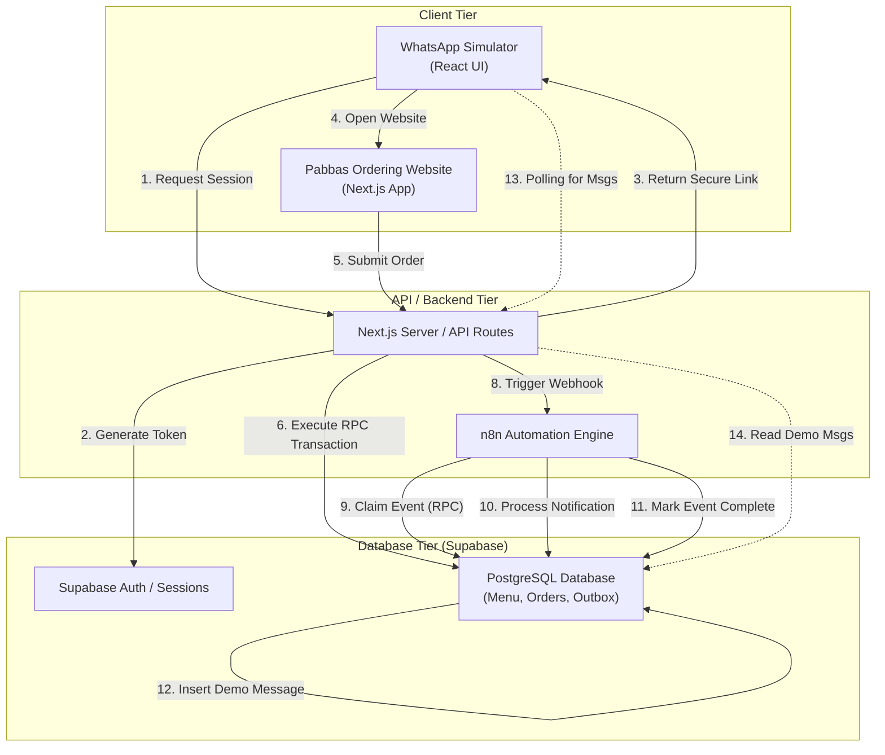

# 3. System Architecture

This document outlines the current state of the architecture (Stage A: CEO Demo). 

## Current Architecture Diagram

## Component Roles

### 1. Next.js (App Router)
Acts as both the frontend UI and the secure middle-tier. Contains React components for the cart/menu and secure API routes that validate requests before communicating with Supabase.

### 2. Supabase
The authoritative System of Record. 
- All pricing, inventory, and table availability logic lives here via strictly locked **RPCs (Remote Procedure Calls)**.
- Row Level Security (RLS) ensures that the Next.js frontend can only access data belonging to the authenticated session.

### 3. n8n
The asynchronous workflow orchestrator.
- Listens for new order events.
- Safely "claims" events from the database to prevent duplicate processing.
- Generates outbound notifications.

### 4. WhatsApp Simulator
A development-only tool (`/dev/whatsapp`) used to demonstrate the customer experience without requiring a live Meta developer account. It relies on a mock database table (`dev_whatsapp_messages`) to display outbox notifications.
