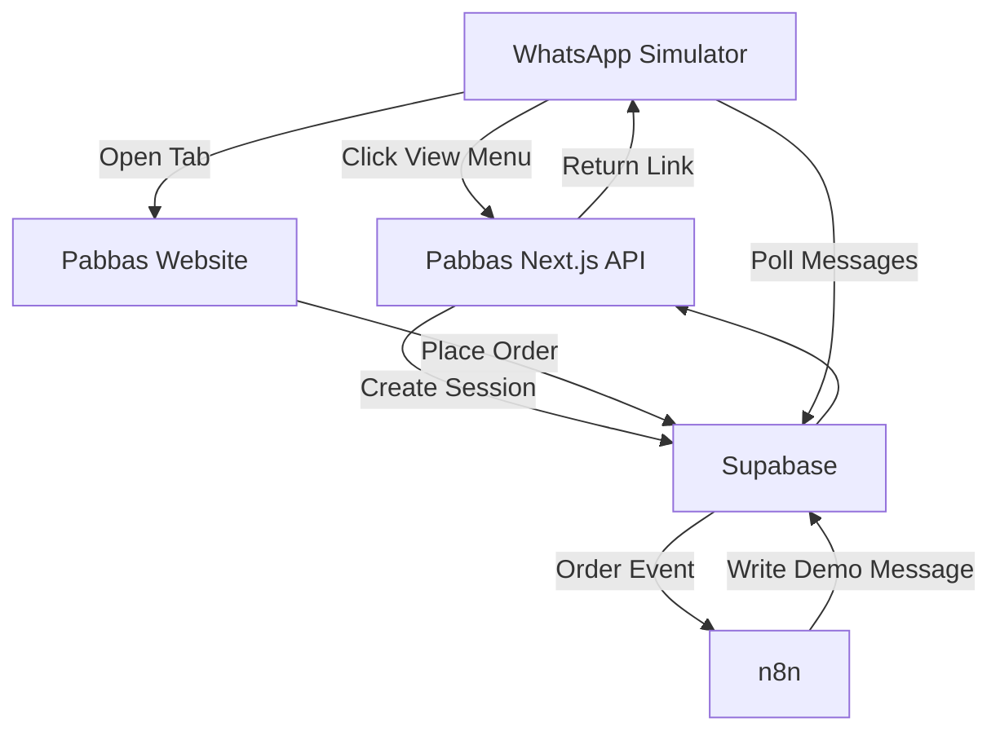
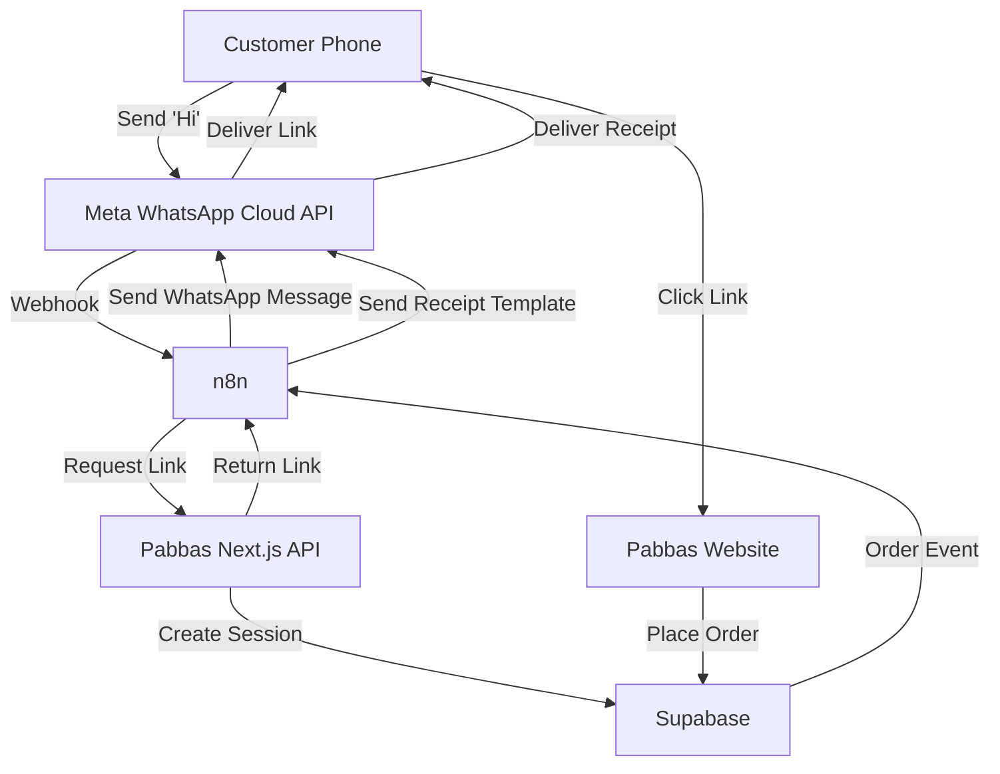
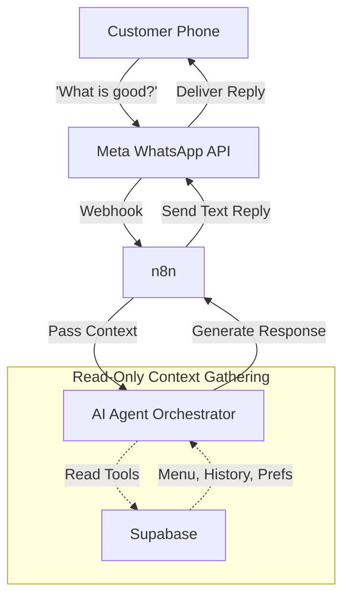

# 4. Customer Journey & 3-Stage Long-Term Architecture

The architecture of Pabbas is designed to evolve gracefully in three distinct stages. The core business logic (Supabase + Next.js) never changes, while the interaction layer matures over time.

---

## STAGE A — CURRENT CEO DEMO
**(DEVELOPMENT / DEMO ONLY)**

In the current stage, the WhatsApp interaction is entirely simulated.

---

## STAGE B — REAL WHATSAPP BUSINESS API
**(PLANNED)**

In Stage B, the Simulator is removed entirely. The Next.js website remains identically functional. Customers interact with a real WhatsApp chat.

### What Changes:
- Simulator is deleted.
- Meta credentials are added to n8n.
- n8n receives live inbound Meta webhooks.
- n8n sends outbound messages using Meta Session/Template rules.

### What Stays Unchanged:
- Supabase RPCs, database, RLS, outbox.
- Next.js website, menu, cart, checkout.
- The fundamental concept of the "WhatsApp-linked Session".

---

## STAGE C — AI PERSONALIZED CONVERSATION
**(PLANNED)**

In Stage C, we insert an AI Orchestrator into the n8n flow. The AI acts as a conversational layer but **NEVER** acts as the system of record.

### Intended AI Capabilities:
- Natural-language conversations.
- Personalized greetings based on customer history.
- Recommending frequently ordered items.
- Understanding delivery vs dine-in intent contextually.

### IMPORTANT RULE: AI Is Not Authoritative
The AI must **NEVER** be trusted to determine final prices, order totals, menu availability, or table availability. It only guides the user. The final order placement ALWAYS routes through the secure, deterministic Next.js / Supabase architecture.
